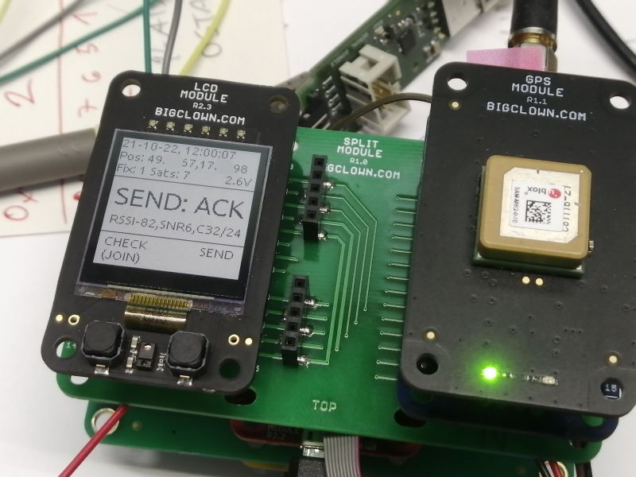

<a href="https://www.hardwario.com/"></a>

# LoRa / LoRaWAN Tester using HARDWARIO TOWER Core Module

[](https://github.com/hardwario/twr-lora-tester/actions/workflows/main.yml)
[](https://github.com/hardwario/twr-lora-tester/releases)
[](https://github.com/hardwario/twr-lora-tester/blob/master/LICENSE)
[](https://twitter.com/hardwario_en)

This repository contains firmware for LoRa Tester.



## Used TOWER Modules

- Core Module (could be NR)
- LoRa Module
- LCD Module
- (Mini) Battery Module
- In case of GPS also Split Module (Compact) and GPS Module

## Firmware update

- Connect your Core Module to the computer
- Download latest bin file from [releases page](https://github.com/hardwario/twr-lora-tester/releases)
- Use [HARDWARIO Playground](https://www.hardwario.com/download/) go to the firmware tab, click on `...` and select downloaded bin file.

## Buttons

- Left button long press - Send JOIN request
- Left button short press - Send Link Check message
- Right button short press - Send confirmed message
- Both button long press - RESET Core Module

## LEDs

LEDS on the LCD Module will blink read or green based on Send, Join or Link Check response.

## GPS

GPS is optional. It is automatically detected if connected.

The GPS is turned on after firwmare boot or when any button is pressed. When no button is pressed within 15 minutes, the GPS is turned off. The GPS keeps its last positional data, so after button is pressed, it does warm boot which can get position within tens of seconds.

## LoRaWAN configuration

Please follow [LoRa AT Commands Configuration
](https://tower.hardwario.com/en/latest/tutorials/lora-at-commands-configuration/) document. There you find how to use USB to configure LoRaWAN parameters.

By typing `AT$HELP` you will see all the supported AT commands. Some might not be in the documentation.

Video tutorial with old TTN V2 interface on how to connect to the network is here
https://www.youtube.com/watch?v=6OqiaGktaKk

The ChirpStack and TTN JavaScript message decoder is in the `src/chirpstack_ttnV3_decoder.js`.

## Low power

The device does not need to be turned off. Without GPS the average consumption is 40 uA. With GPS Module turned off after 15 minutes of inactivity the consumption is around 60 uA.

## Troubleshooting LoRa Module and ERR status

**This applies only to LoRa tester FW older than 1.10.0, which has now automatic baudrate recovery**

In case of LoRa Module not communicating. Open the serial terminal and copy the initialization output. It looks like this:

```
<\n># 0.51 <E> APP: GPS Module initialization failed<\r>
<\n>$FW: "vdev"# 0.51 <D> LoRa TX: <\r>
AT<\r>
<\r>
<\n># 0.62 <D> LoRa RX: +OK<\r>
<\r>
<\n># 0.62 <D> LoRa TX: AT+VER?<\r>
<\r>
<\n># 0.72 <D> LoRa RX: +OK=1.1.03,Dec 20 2018 15:00:56<\r>
<\r>
<\n># 0.72 <D> LoRa TX: AT+DEV?<\r>
<\r>
<\n># 0.82 <D> LoRa RX: +OK=ABZ-093<\r>
<\r>
<\n># 0.82 <D> LoRa TX: AT+DFORMAT=0<\r>
...
```

The initialization i repeated every 3 seconds. You can copy only single initialization.

In case the LoRa Module does not reply even to the firt `AT` command

```
<D> LoRa TX: <\r>
AT<\r>
... <no reponse here>
```

It might be that LoRa Module is misconfigured. You might try [twr-uart-passthrough
](https://github.com/hubmartin/twr-uart-passthrough/releases) firmware which connect Core Module USB UART directly to the LoRa Module.

Use picocom to correctly set the newline to `cr` and check communication on 9600 baud.

```
picocom -b 9600 --echo  /dev/ttyUSB0
```

Type `AT`, `AT+VER?` to see if module works and which firmware it contains.

If no reply then tr yto connect to the module with factory default 19200 baud:

```
picocom -b 9600 --echo  /dev/ttyUSB0
```

And try again `AT`, `AT+VER?`. If you get reply, then configure communication speed to 9600 baud by typing `AT+UART=9600` and send `AT+REBOOT` or power reset the LoRa Module.

## License

This project is licensed under the [MIT License](https://opensource.org/licenses/MIT/) - see the [LICENSE](LICENSE) file for details.

---

Made with &#x2764;&nbsp; by [**HARDWARIO s.r.o.**](https://www.hardwario.com/) in the heart of Europe.
